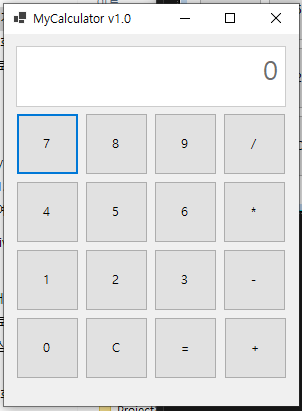
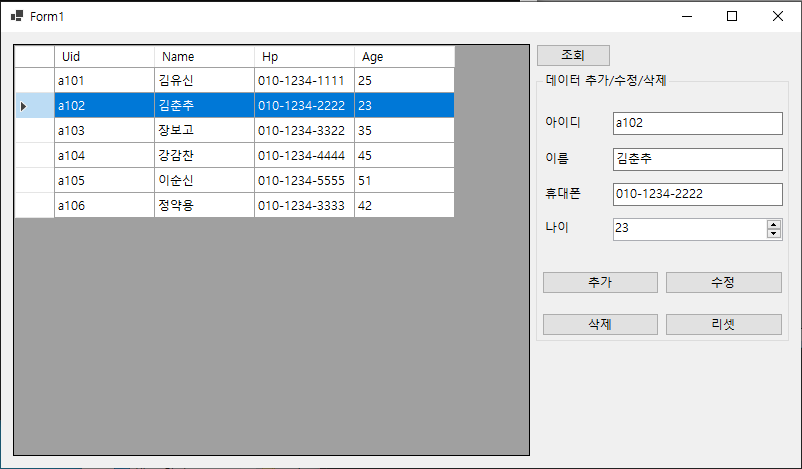
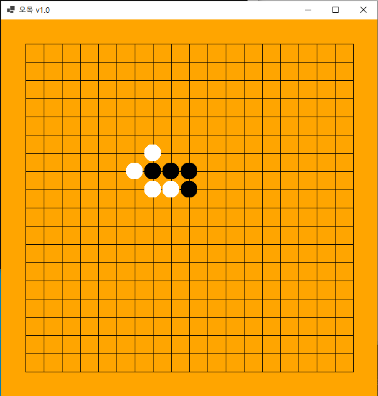
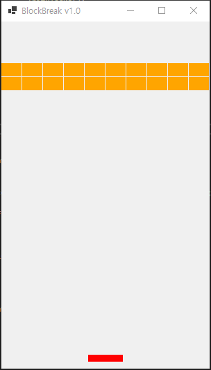

# C\# 프로그래밍

## Ch01. Hello World
## Ch02. 변수와 자료형 그리고 연산자
	- 1. Variable   변수
	- 2. DataType   자료형
	- 3. Operator   연산자
	- 4. InputTest  기본입력
	- 5. Conversion 자료형 변환
	- 6. String     문자열
	
## Ch03.
	- 1. if     조건문
	- 2. Swicth 조건문
	- 3. For    반복문
	- 4. While  반복문
	- 5. Array  배열
	
## Ch04.
	- 1. Method          메서드
	- 2. MethodType      메서드 타입
	- 3. MethodOverload  메서드 오버로딩
	- 4. MethodStack     메서드 스택
	- 5. MethodParameter 메서드 출력전용 매개변수

## Ch05.
	- 1. Class 	      클래스와 객체
	- 2. Encaps       캡슐화
	- 3. Static       클래스 변수
	- 4. Inheritance  클래스 상속
	- 5. Override     오버라이드
	- 6. Polymorphism 다형성
	
## Ch06.
	- 1. AbstractClass 추상 클래스
	- 2. Interface     인터페이스
	- 3. Structure     구조체
	- 4. Generic       제네릭
	- 5. Indexer       인덱서
	- 6. InternalClass 내장 클래스

## Ch07.
	- 1. Stack     컬렉션 
	- 2. Queue     컬렉션 
	- 3. ArrayList 컬렉션
	- 4. HashTable 컬렉션 HashTable/Dictionary
	- 5. HashSet   컬렉션

## Ch08.
	- 1. Try    예외처리
	- 2. Throw  예외처리
	- 3. FileIO 파일 입출력

## Ch09.
	- 1. Delegate 대리자
	- 2. Lambda   익명 메서드
	- 3. Linq    (Language Intergrated Query) 데이터 쉽게 관리

## Ch10.
	- 1. DBConnection 데이터베이스 프로그래밍
	- 2. Insert       데이터베이스 프로그래밍
	- 3. Select       데이터베이스 프로그래밍

## Ch11.

1. 프로젝트 유형
	- WinForm 프로젝트
2. 활용기술
	- 컨트롤
	

1. 프로젝트 유형
	- WinForm 프로젝트
2. 활용기술
	- 컨트롤

## Project1. 계산기

1. 프로젝트 유형
	- WinForm 프로젝트
2. 활용기술
	- 컨트롤
	- 이벤트와 핸들러
	
## Project2. 데이터 매니저

1. 프로젝트 유형
	- WinForm 프로젝트
2. 활용기술
	- 컨트롤
	- 이벤트와 핸들러
	- 데이터베이스와 SQL
	
## Project3. 오목

1. 프로젝트 유형
	- WinForm 프로젝트
2. 활용기술
	- 윈도우 그래픽
	- 이벤트와 핸들러
	
## Project4. 벽돌깨기

1. 프로젝트 유형
	- WinForm 프로젝트
2. 활용기술
	- 윈도우 그래픽
	- Timer와 핸들러

